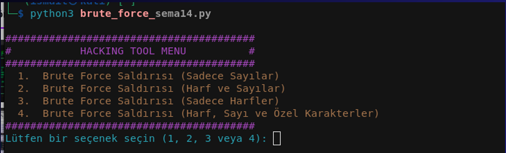
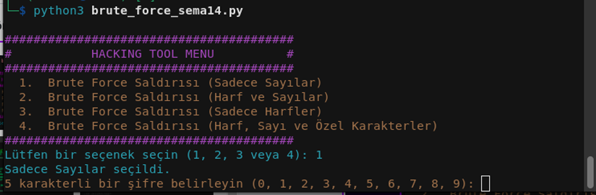
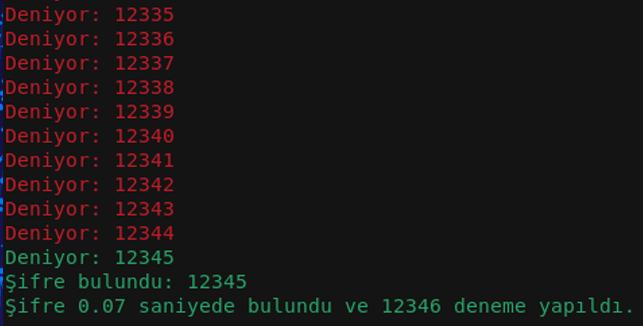
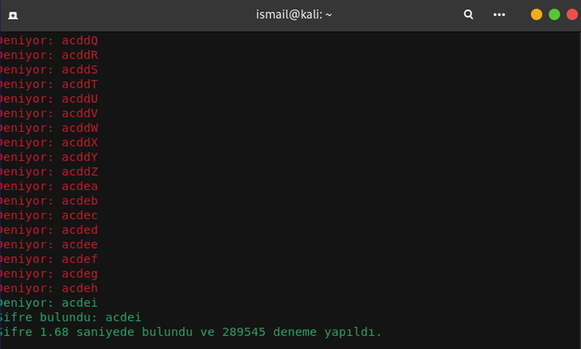

# 🔐 Brute Force Awareness Tool

Bu proje, **şifrelerin brute force (kaba kuvvet) saldırılarına karşı ne kadar savunmasız olabileceğini** göstermek ve **parola güvenliği konusunda farkındalık yaratmak** amacıyla hazırlanmıştır. **Gerçek saldırı amacıyla kullanılması kesinlikle yasaktır!**

---

## 📌 Özellikler

- **Farklı karakter setleri ile brute force simülasyonu**:
  - **Sadece Sayılar (0-9)**
  - **Harfler ve Sayılar (a-z, A-Z, 0-9)**
  - **Sadece Harfler (a-z, A-Z)**
  - **Harf, Sayı ve Özel Karakterler (!, @, #, ...)**

- **Kullanıcıdan şifre alma ve gizli olarak gösterme (****** şeklinde**)**
- **Deneme sayısı ve geçen süreyi raporlama**
- **Renkli terminal çıktısı (Colorama ile)**

---

## 📸 Ekran Görüntüsü (Önerilen)

### **1. Menü Ekranı**


### **2. Şifre Belirleme**


### **3. Brute Force Denemeleri**



> **Not:** `screenshots` klasörünü oluşturup, terminal görüntülerinizi oraya ekleyin.  

---

## 🚀 Kurulum ve Çalıştırma

1. Bu projeyi indirin:
   ```bash
   git clone https://github.com/ismailkaya32/bruteforce-awareness-tool.git
   cd bruteforce-awareness-tool
